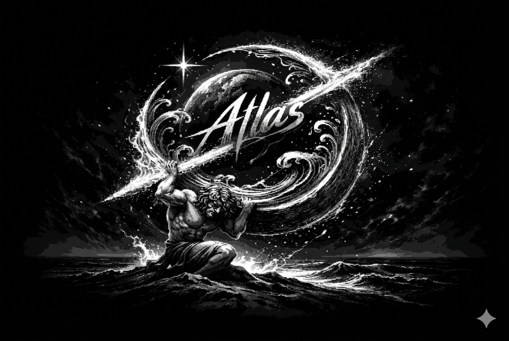

# ATLAS — Structured Discourse

<p align="center">
  
</p>

<p align="center">
  <strong>Think. Discourse.</strong><br/>
  Structured conversation without chaos.
</p>

---

## Overview

**ATLAS** is a structured Discord community built around disciplined discussion.

It is **not** a religion-only server.  
Debate is central — but topics vary:

- Philosophy  
- Ethics (religious & philosophical)  
- Theology  
- Gaming  
- Anime  
- Books  
- Culture  
- Open discourse  

The environment is chill, but the standards are strict.

---

## ___Core Principles___

### **Respect is Fundamental**
Critique ideas — not people.  
No insults. No hate. No personal attacks.

### **Freedom of Expression ≠ Abuse**
Rational discussion is welcome.  
Provocation, hostility, or incitement is not.

### **Structured Moderation**
Clear penalty system.  
Decisions are enforced.  
Severe violations = immediate permanent ban.

---

## 🌐 Links

### **Website**
https://lilzeng1.github.io/Atlas/

### **Discord Server**
https://discord.gg/VsHgBpQGT8

### **Instagram**
https://instagram.com/lilzeng1  
@lilzeng1

---

## 🛠 Tech Stack

- **Frontend:** HTML, TailwindCSS, Custom CSS  
- **Backend:** Node.js, Express  
- **Database:** MongoDB (Mongoose)  
- **Auth:** Discord OAuth2  
- **Deployment:** GitHub Pages + Node backend  

---

## 📁 Project Structure

```
/Assets
  /Server
    ServerIcon.png

/Styles
  Home.css

/Scripts
  Home.js

index.html
index.js
```

---

## ___Mission Statement___

> A platform where ideas compete —  
> without people being attacked.

Clean interface.  
Clear rules.  
Direct enforcement.  

No noise. Only discourse.

---

© 2026 ATLAS — All Rights Reserved
